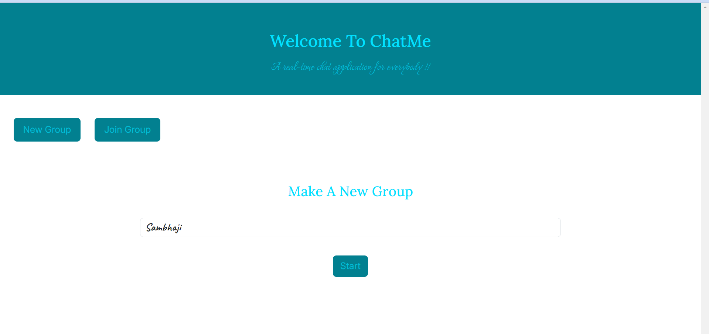
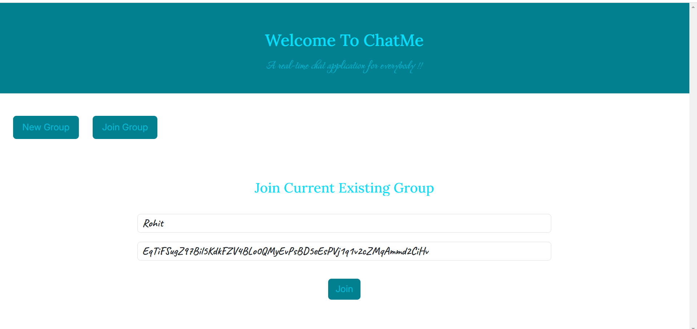
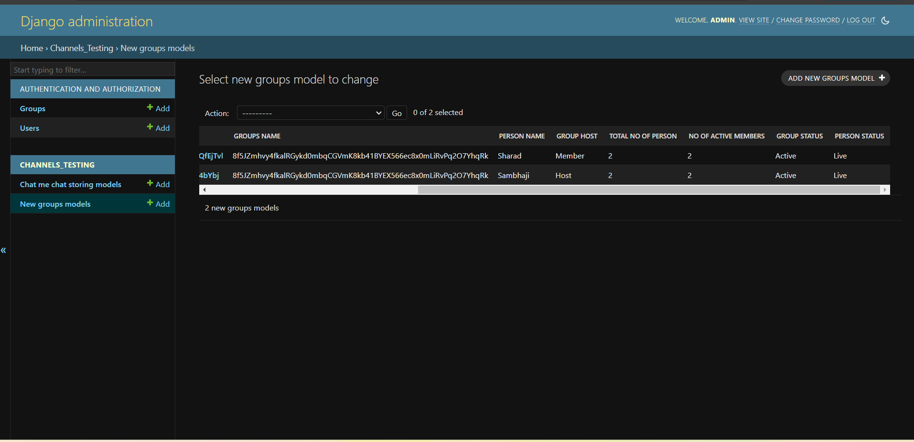
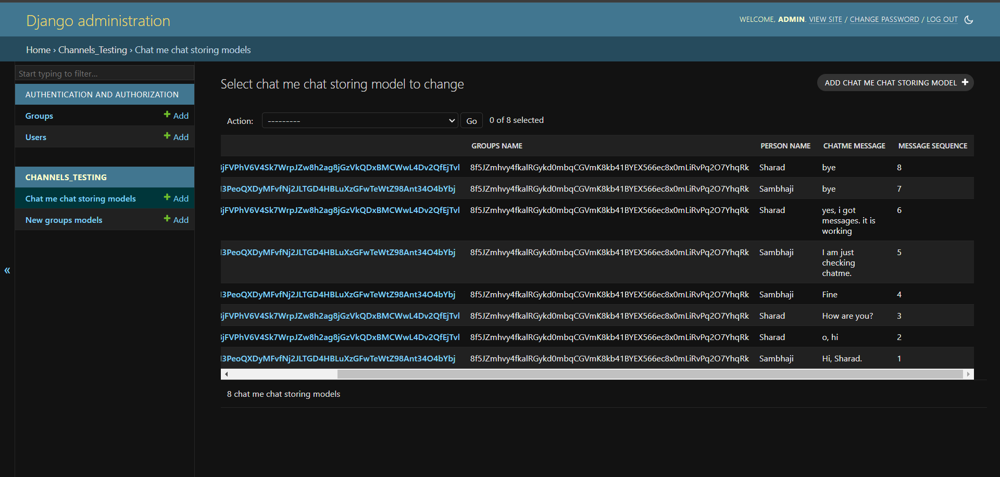
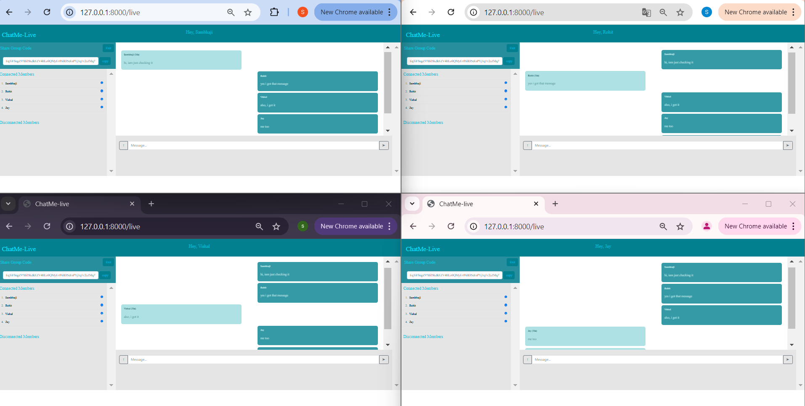
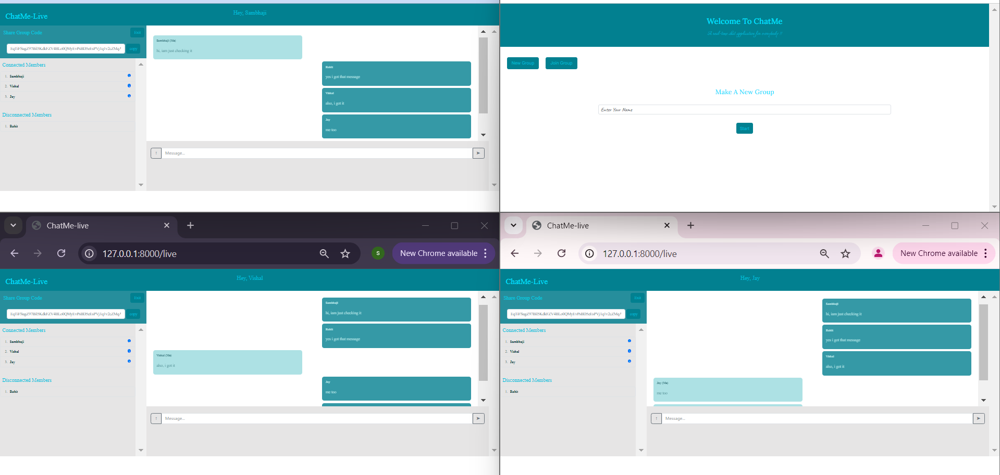
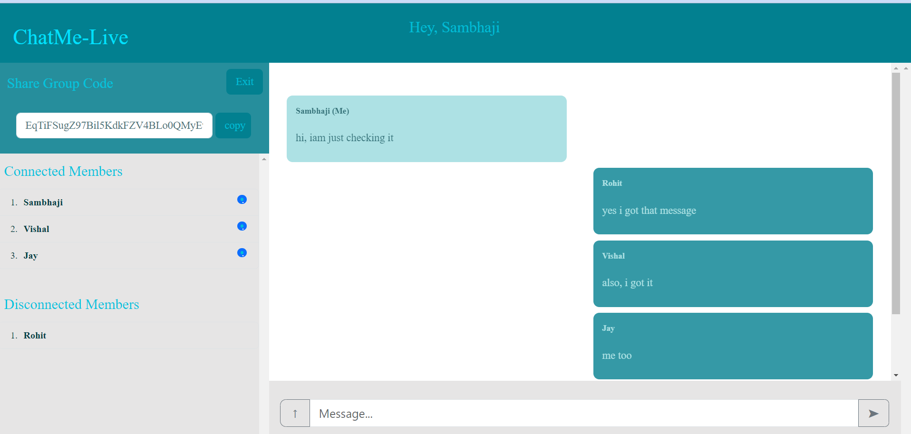
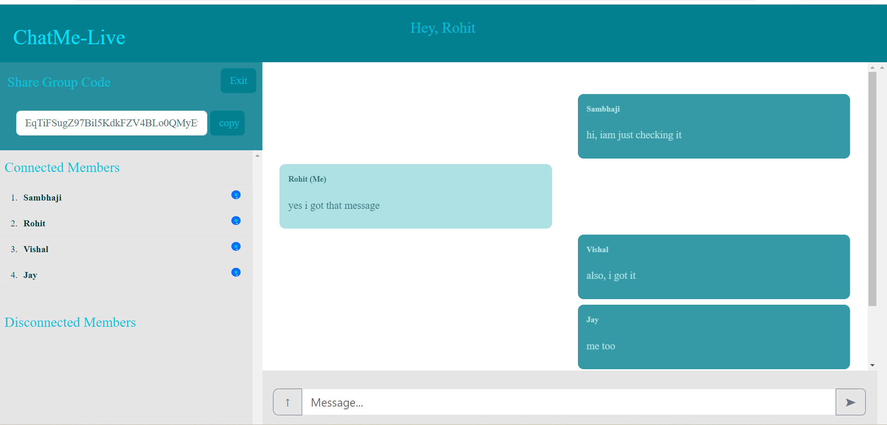
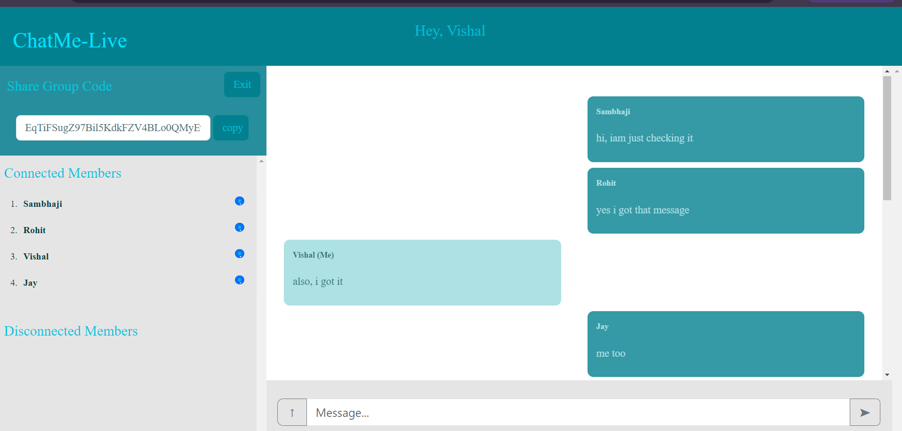
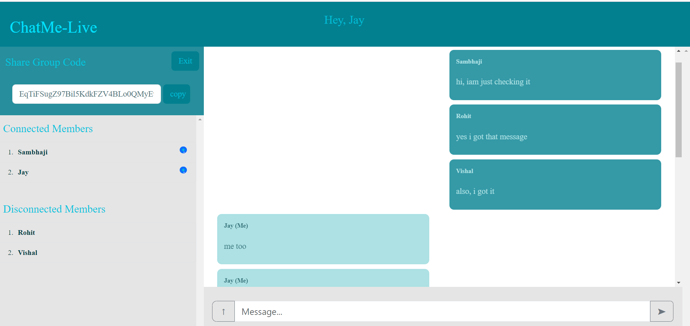

# ChatMe - Real Time Chatting Application

Welcome to the Real-Time Chatting Application! This is a Django-based chat application that allows multiple users to communicate in real time through various chat rooms. Whether you're working on a collaborative project or simply catching up with friends, this application offers an interactive and dynamic messaging experience.

## Features

- **Real-Time Messaging**: Engage in instant conversations with real-time updates using WebSockets.
- **Multiple Chat Rooms**: Create and join different chat rooms to discuss various topics.

## Demo

### Screenshots

<p align="center">
  
  
  
  
</p>
<p align="center">
  
  
  
  
</p>
<p align="center">
  
  
</p>

### Video

<video autoplay loop muted playsinline width="100%" height="auto">
    <source src="Chat-Video/upload-video.mp4" type="video/mp4">
</video>

## Installation

To set up this application locally, follow these steps:

1. **Clone the Repository**
   ```bash
   git clone (https://github.com/SambhajiShinde28/ChatMe.git)
   cd your-root-repository-name

2. **Set Up a Virtual Environment**
   ```bash
   python -m venv env
   Activate Env : venv/scripts/activate

3. **Install Dependencies**
   ```bash
   pip install -r requirement.txt

4. **Apply Migrations**
   ```bash
   python manage.py makemigrations
   python manage.py migrate

5. **Create SuperUser**
   ```bash
   python manage.py createsuperuser

6. **Run the Development Server**
   ```bash
   python manage.py runserver

7. **Open Your Browser and Visit**
   ```bash
   http://127.0.0.1:8000/

## Usage

- **New Group**: Click on new group btn and enter your Name and start meeting.
- **Share code**: Copy your group code and share to friends.
- **Join Group**: Click on join group btn and enter your Name & Group Code and Join meeting.
- **Chat**: Now both can chat with each other and you can add multiple members.

## Contact

- [LinkedIn](https://www.linkedin.com/in/sambhaji-shinde-1679ab309/)
- [Instagram](https://www.instagram.com/sambhaji_26/)
